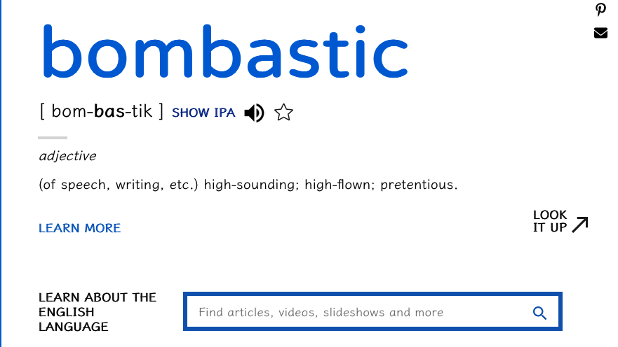
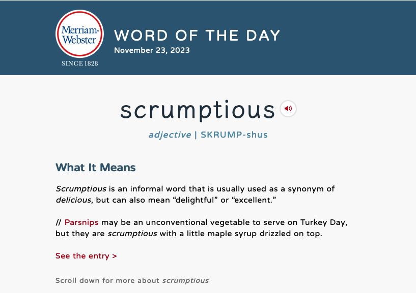
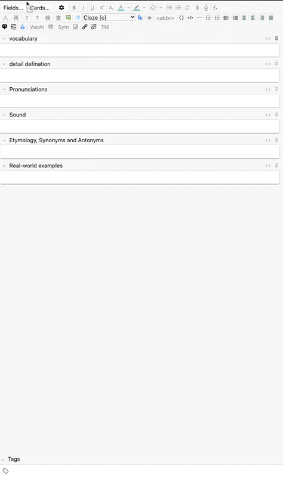
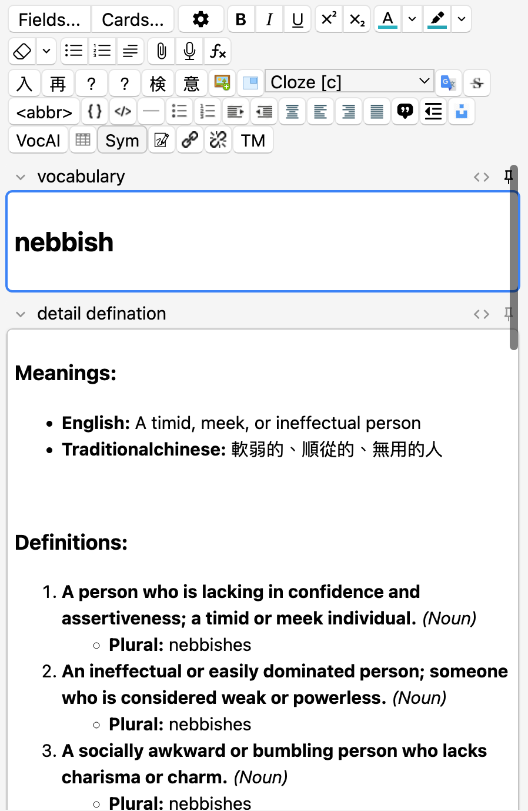
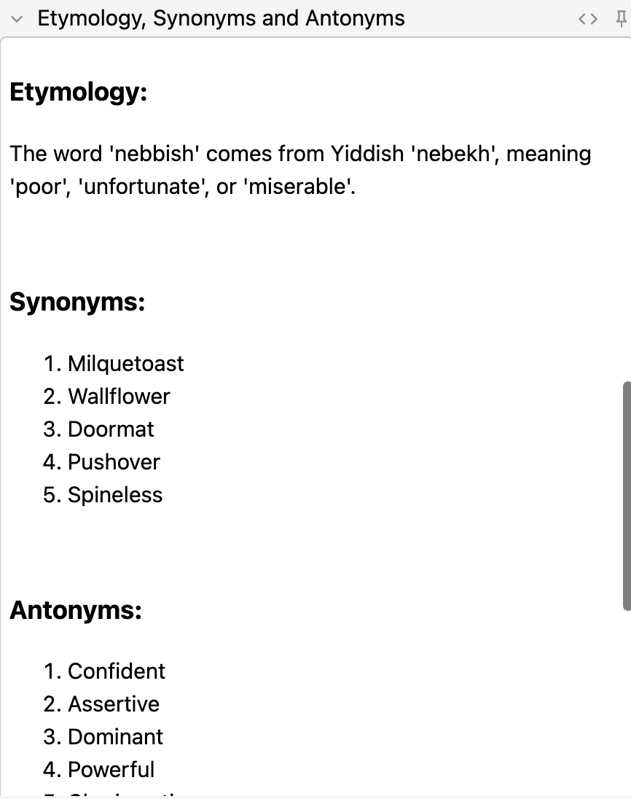
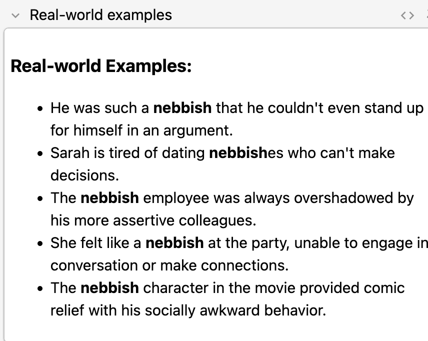

# VocBuilderAI for Anki

## Description:
[Taiwan language version](README_ZH_TW.md)
VocBuilderAI is an Anki add-on designed to enhance vocabulary learning by leveraging OpenAI's GPT-3.5 Turbo and Whisper APIs. It allows users to generate detailed notes for new vocabulary words, complete with definitions, pronunciations, etymologies, synonyms, antonyms, and real-world examples.

- 
- 
## Features:
    - Generate comprehensive vocabulary notes.
    - Integrate with OpenAI's GPT-3.5 Turbo for detailed definitions and examples.
    - Use OpenAI's TTS (text-to-speech) model for pronunciation audio.
    - Customizable settings for default deck, note type, and tags.
    - User-friendly interface integrated into Anki's Add Note window.

## Installation:
    - Install it in Anki using the provided code or installation file.
    - Configure the add-on settings, including the OpenAI API key, in Anki's Add-on menu.
### Node Type
create a node type called "vocbuilderAI" with following fields:
  - vocabulary
  - detail defination
  - Pronunciations
  - Sound
  - Etymology, Synonyms and Antonyms
  - Real-world examples
## Usage:

    - Open the Add Note window in Anki.
    - Click on the "VocabBuilderAI" button or menu item.
    - Enter a new vocabulary word and the add-on will generate the complete note.

  
  
  

## Configuration:

    - OpenAI API Key: Required for accessing OpenAI services.
    - Default Deck: The deck where new notes will be added if not specified.
    - Default Note Type: The note type used for new vocabulary notes.
    - Speech Voice: Select the voice for TTS audio.

## Support:
For support, questions, or feature requests, please visit the GitHub repository or contact the add-on author.
## TODO
- [x] add japanese vocabulary learning
- [x] use different whisper sounds randomly.
- [ ] at installation, check there is a vocbuilderAI note type or not, creating it for users automatically
- [ ] add type(pydantic?) to it for better development
- [ ] if openai is too slow, show timeout info, ask user to try again later
- [x] use prompts.py to store prompt.
- [ ] fix json/dict parsed in english word