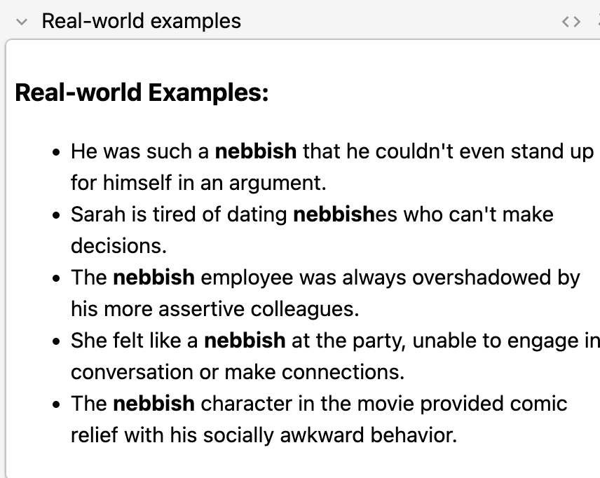

# VocBuilderAI for Anki

[English](#english) | [繁體中文](#traditional-chinese)

## English

VocabBuilderAI is an Anki add-on that enhances vocabulary learning by integrating with multiple LLM providers. It generates comprehensive flashcards including definitions, pronunciations, etymology, synonyms, antonyms, and real-world examples.

### Supported LLM Providers
- OpenAI
- DeepSeek
- Groq
- OpenRouter

### Recommended Models
Model names change quickly, so VocBuilderAI lets you type any chat-completions compatible model supported by your provider.

For the best results in 2026, use a current general-purpose model with strong JSON output and multilingual support. Recommended starting points:
- OpenAI: use the current small or flagship GPT model for balanced cost and quality.
- OpenRouter: choose a recent high-quality model with Japanese and Traditional Chinese support.
- DeepSeek or Groq: use their current chat/reasoning model if you prefer lower cost or faster generation.

Leave the model field blank to use VocBuilderAI's provider default. If Japanese output is incomplete, switch to a stronger multilingual model before raising temperature.

### Features
- Comprehensive vocabulary flashcards
- Multiple LLM provider support
- Text-to-speech for pronunciation
- Customizable decks, card types, and tags
- Seamless Anki integration

### Installation
1. Download from AnkiWeb or GitHub
2. Install via Anki's add-on manager
3. Configure API keys and preferences

### Note Type Setup
Create a note type called "vocbuilderAI" with these fields:
- Vocabulary
- Detail definition
- Pronunciations
- Sound
- Etymology, Synonyms, and Antonyms
- Real-world examples

### Usage
1. Open Anki's card creation window
2. Click "VocabBuilderAI"
3. Enter your word
4. Let AI generate the content

### Configuration
1. Go to Tools -> VocBuilderAI Settings
2. Configure:
   - API keys (OpenAI/Deepseek/Groq/OpenRouter)
   - LLM provider selection (OpenAI, Deepseek, Groq, OpenRouter)
   - Default deck and note type
   - Temperature and other model settings
   - Text-to-speech preferences
3. Click Save to apply changes immediately

### TODO

## Traditional Chinese

VocabBuilderAI 是一款 Anki 擴充功能，透過整合多個 LLM 供應商來增強單詞學習體驗。它能自動生成包含定義、發音、詞源、同義詞、反義詞及實際例子的完整記憶卡片。

### 支援的 LLM 供應商
- OpenAI
- DeepSeek
- Groq
- OpenRouter

### 推薦模型
模型名稱更新很快，所以 VocBuilderAI 不會把模型寫死；你可以填入供應商支援的任何 chat-completions 相容模型。

2026 年建議優先選擇 JSON 輸出穩定、日文與繁體中文能力好的通用模型：
- OpenAI：使用當前的小型或旗艦 GPT 模型，在成本與品質之間通常最穩。
- OpenRouter：選擇近期品質高、明確支援日文與繁體中文的模型。
- DeepSeek 或 Groq：如果你重視成本或速度，可以使用它們當前的 chat/reasoning 模型。

Model 欄位留空時，VocBuilderAI 會使用該 provider 的預設模型。如果日文輸出不完整，先換成更強的多語模型，再考慮調高 temperature。

### 功能特點
- 全面的單詞記憶卡片
- 支援多個 LLM 供應商
- 文字轉語音發音
- 可自訂牌組、卡片類型和標籤
- 無縫整合 Anki

### 安裝方式
1. 從 AnkiWeb 或 GitHub 下載
2. 透過 Anki 擴充功能管理器安裝
3. 設定 API 金鑰和偏好設定

### 筆記類型設定
建立名為 "vocbuilderAI" 的筆記類型，包含以下欄位：
- Vocabulary
- Detail definition
- Pronunciations
- Sound
- Etymology, Synonyms and Antonyms
- Real-world examples

### 使用方法
1. 開啟 Anki 的卡片建立視窗
2. 點擊 "VocabBuilderAI"
3. 輸入單詞
4. 讓 AI 生成內容

### 設定選項
1. 前往 工具 -> VocBuilderAI Settings
2. 設定以下項目：
   - API 金鑰 (OpenAI/Deepseek/Groq/OpenRouter)
   - LLM 供應商選擇 (OpenAI, Deepseek, Groq, OpenRouter)
   - 預設牌組和筆記類型
   - Temperature 和其他模型設定
   - 文字轉語音偏好
3. 點擊儲存立即套用變更

## Support | 支援
For support, questions, or feature requests, please visit our GitHub repository.
如需支援、問題或功能請求，請訪問我們的 GitHub 專案頁面.
