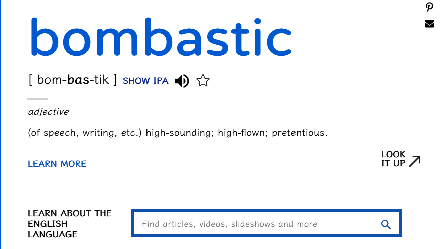
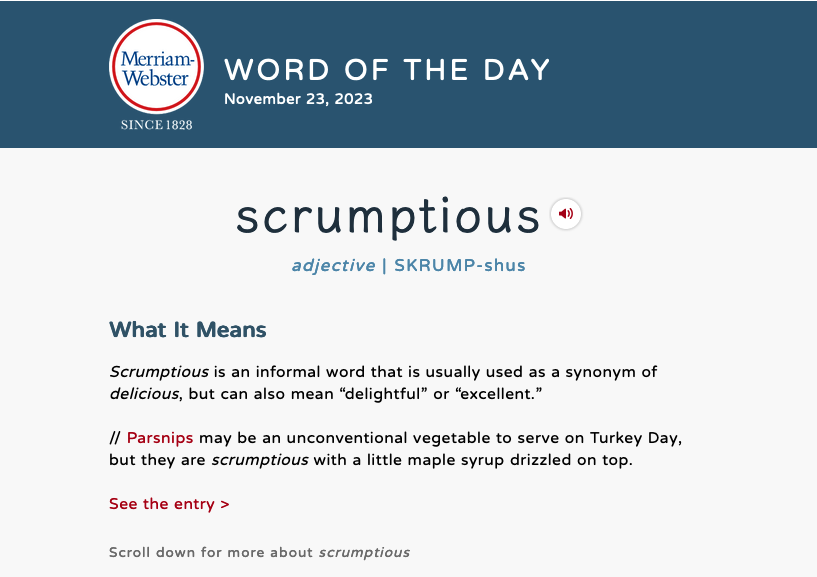
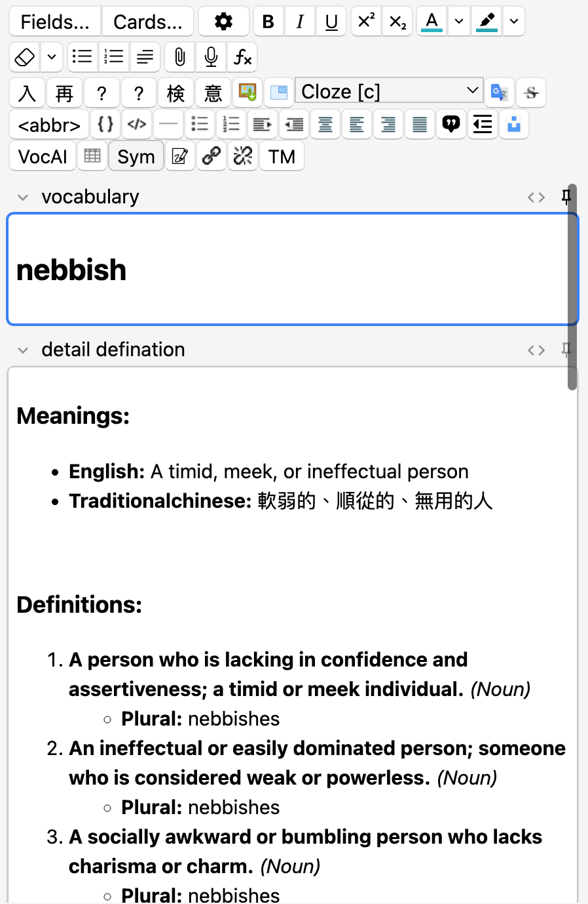
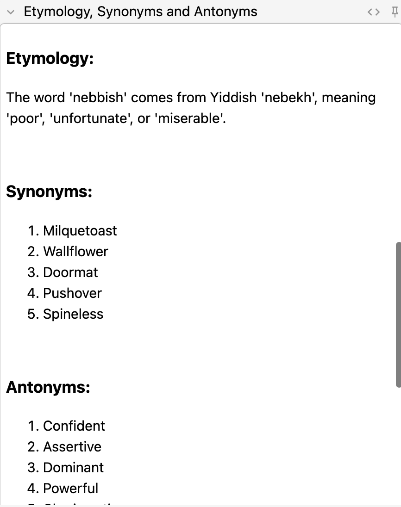

# VocBuilderAI for Anki

[English](#english) | [繁體中文](#traditional-chinese)

## English

VocabBuilderAI is an Anki add-on that enhances vocabulary learning by integrating with multiple LLM providers. It generates comprehensive flashcards including definitions, pronunciations, etymology, synonyms, antonyms, and real-world examples.

### Supported LLM Providers
- OpenAI
- Groq
- OpenRouter
- Custom OpenAI-compatible providers, including LiteLLM

### Recommended Models
Model names change quickly, so VocBuilderAI lets you type any chat-completions compatible model supported by your provider.

For the best results in 2026, use a current general-purpose model with strong JSON output and multilingual support. Recommended starting points:
- OpenAI: use the current small or flagship GPT model for balanced cost and quality.
- OpenRouter: choose a recent high-quality model with Japanese and Traditional Chinese support.
- Groq: use its current chat/reasoning model if you prefer faster generation.

Leave the model field blank to use VocBuilderAI's provider default. If Japanese output is incomplete, switch to a stronger multilingual model before raising temperature.




### Features
- Comprehensive vocabulary flashcards
- Math flashcards with LaTeX formulas rendered through MathJax
- Multiple LLM provider support, including custom OpenAI-compatible endpoints
- Text-to-speech for pronunciation through OpenAI or custom OpenAI-compatible TTS
- Settings health checks for API, Japanese JSON, and text-to-speech
- Generation modes for concise, standard, deep, or Japanese-focused cards
- Safer JSON parsing and config migration for add-on upgrades
- Short-lived cache for repeated identical generations
- Customizable decks, card types, and tags
- Seamless Anki integration

<video src="media/vocAI-demo-1.mp4" controls muted loop></video>

### Installation
1. Download `vocbuilderai-*.ankiaddon` from the GitHub Releases page.
2. In Anki, open `Tools -> Add-ons -> Install from file`.
3. Select the downloaded `.ankiaddon` file.
4. Restart Anki after installing or updating the add-on.
5. Open `Tools -> VocBuilderAI Settings`.
6. Add at least one API key for OpenAI, Groq, OpenRouter, or a custom provider.
7. Run the built-in health checks before generating cards.

For local development, symlink the add-on files into Anki's add-on directory:

```bash
mkdir -p ~/.local/share/Anki2/addons21/voc_builder_ai
ln -sf "$PWD/__init__.py" ~/.local/share/Anki2/addons21/voc_builder_ai/__init__.py
ln -sf "$PWD/prompts.py" ~/.local/share/Anki2/addons21/voc_builder_ai/prompts.py
ln -sf "$PWD/config.json" ~/.local/share/Anki2/addons21/voc_builder_ai/config.json
ln -sf "$PWD/manifest.json" ~/.local/share/Anki2/addons21/voc_builder_ai/manifest.json
ln -sf "$PWD/llm.py" ~/.local/share/Anki2/addons21/voc_builder_ai/llm.py
ln -sf "$PWD/settings.py" ~/.local/share/Anki2/addons21/voc_builder_ai/settings.py
ln -sf "$PWD/parsing.py" ~/.local/share/Anki2/addons21/voc_builder_ai/parsing.py
ln -sf "$PWD/formatters.py" ~/.local/share/Anki2/addons21/voc_builder_ai/formatters.py
```

Keep `meta.json` inside the Anki add-on directory. It is user-specific and may contain API keys, so it should not be committed.

### Note Type Setup
Create a note type called "vocbuilderAI" with these fields:
- vocabulary
- detail definition
- Pronunciations
- Sound
- Etymology, Synonyms and Antonyms
- Real-world examples

Field matching ignores case, spaces, and commas, so note types created with names
like `Vocabulary` or `Etymology, Synonyms, and Antonyms` also work.

### Configuration
Open `Tools -> VocBuilderAI Settings` and configure these tabs:

- `Generation`: choose OpenAI, Groq, OpenRouter, or Custom; choose a generation mode; set model, temperature, max tokens, and cache behavior.
- `API Keys`: enter the API key for the provider you want to use.
- `Anki`: set the default deck, tag, and note type.
- `Speech`: set the speech provider — Qwen3-TTS via LiteLLM (`qwen`, the default), OpenAI, or a custom OpenAI-compatible TTS — including model, voice, format, and speed.

Generation modes:

- `Concise`: shorter cards with fewer examples.
- `Standard`: balanced default for daily use.
- `Deep`: richer definitions and usage notes.
- `Japanese`: Japanese-focused output with stable readings, grammar, and Traditional Chinese translations.

Leave the model field blank to use the provider default.

For a self-hosted LiteLLM service, choose `custom`, set the custom base URL to your endpoint (for example `http://your-litellm-server:4000/v1`), and use one of these models:

- `qwen36-fast`
- `qwen36-deep`
- `qwen36-35b-heretic`

Keep `Disable Qwen thinking` enabled for these models. It sends the vLLM/LiteLLM `enable_thinking=false` option so the add-on receives final JSON in `message.content`.

For Qwen3-TTS, keep `Speech -> Provider` on `qwen` (the default). Audio routes through the LiteLLM proxy configured for chat under `custom` (same base URL and `custom_api_key`), so no extra keys are needed:

- Model: `qwen-tts`
- Format: `wav` (24 kHz)
- Voice: leave blank to rotate multilingual voices automatically, or pin one: Vivian, Serena, Uncle_Fu, Dylan, Eric, Ryan, Aiden, Ono_Anna, Sohee
- Speed: set in the `Speed` field (0.25-4.0)

For a self-hosted Kokoro TTS (Speaches) service, set `Speech -> Provider` to `custom`, set the custom base URL to your endpoint (for example `http://your-tts-server:8001/v1`), and use:

- Model: `speaches-ai/Kokoro-82M-v1.0-ONNX`
- Format: `wav`
- Sample rate: `24000`
- Voice: leave blank to choose a live-verified voice automatically. English words use American `af_*` / `am_*` voices; Japanese words use `jf_*` / `jm_*` voices.

Japanese TTS uses the generated `furigana` reading when available, so kanji such as `禁煙` are spoken from kana like `きんえん` instead of leaving pronunciation entirely to the TTS model.

### Health Checks
Before generating cards, use these buttons in `Tools -> VocBuilderAI Settings`:

- `Test API`: verifies the selected provider, model, API key, and JSON response.
- `Test Japanese JSON`: verifies that Japanese output can be generated and parsed safely.
- `Test TTS`: verifies the configured text-to-speech settings.

If a check fails, change the API key, provider, or model before creating cards.

### Usage
1. Open Anki's `Add` window.
2. Select the `vocbuilderAI` note type.
3. Type the English or Japanese word in the first field.
4. Click the `VocAI` button in the editor toolbar.
5. Review the generated fields.
6. Click `Add` to save the note.

To explain the grammar of a whole Japanese sentence, type the sentence in the first field and click the `文法` button instead. It fills the same `vocbuilderAI` fields with the sentence, kana reading, a Traditional Chinese translation, point-by-point grammar explanations, related patterns, and example sentences.

For Japanese vocabulary, use the `Japanese` generation mode if you want more consistent readings, grammar, and Traditional Chinese translations.





### Math Cards

Use any note type with `Front` and `Back` fields — Anki's built-in `Basic` note type works.

1. Open Anki's `Add` window and switch the note type to `Basic` (or any type with `Front` and `Back`).
2. Paste a math formula, a question, or a theorem name into the `Front` field. LaTeX input is fine.
3. Click the `∑` button in the editor toolbar.
4. Review the generated `Back` field: a Traditional Chinese explanation, a step-by-step calculation or derivation, a worked example, and extra notes.
5. Click `Add` to save the card.

Every generated formula uses LaTeX — `\(...\)` for inline math and `\[...\]` for display math — which Anki renders with MathJax.


### Troubleshooting
- `Unsupported parameter: max_tokens`: update to the latest add-on version. OpenAI uses `max_completion_tokens`.
- Japanese cards are incomplete: run `Test Japanese JSON`, switch to `Japanese` mode, or use a stronger multilingual model.
- The button does not appear: restart Anki after installing or updating the add-on.
- API errors: verify the selected provider, model name, and API key in settings.
- No audio: verify the selected speech provider, API key, base URL, model, and run `Test TTS`.

## Traditional Chinese

VocabBuilderAI 是一款 Anki 擴充功能，透過整合多個 LLM 供應商來增強單詞學習體驗。它能自動生成包含定義、發音、詞源、同義詞、反義詞及實際例子的完整記憶卡片。

### 支援的 LLM 供應商
- OpenAI
- Groq
- OpenRouter
- 自訂 OpenAI-compatible 供應商，例如 LiteLLM

### 推薦模型
模型名稱更新很快，所以 VocBuilderAI 不會把模型寫死；你可以填入供應商支援的任何 chat-completions 相容模型。

2026 年建議優先選擇 JSON 輸出穩定、日文與繁體中文能力好的通用模型：
- OpenAI：使用當前的小型或旗艦 GPT 模型，在成本與品質之間通常最穩。
- OpenRouter：選擇近期品質高、明確支援日文與繁體中文的模型。
- Groq：如果你重視速度，可以使用它目前的 chat/reasoning 模型。

Model 欄位留空時，VocBuilderAI 會使用該 provider 的預設模型。如果日文輸出不完整，先換成更強的多語模型，再考慮調高 temperature。

### 功能特點
- 全面的單詞記憶卡片
- 數學卡片，公式以 LaTeX（MathJax）呈現
- 支援多個 LLM 供應商，包含自訂 OpenAI-compatible endpoint
- 透過 OpenAI 或自訂 OpenAI-compatible TTS 產生文字轉語音發音
- 設定頁可測試 API、日文 JSON 與文字轉語音
- 可選擇簡潔、標準、深入或日文優先的生成模式
- 更穩定的 JSON 解析與升級設定 migration
- 對重複的相同生成請求提供短期快取
- 可自訂牌組、卡片類型和標籤
- 無縫整合 Anki

### 安裝方式
1. 從 GitHub Releases 頁面下載 `vocbuilderai-*.ankiaddon`。
2. 在 Anki 打開 `Tools -> Add-ons -> Install from file`。
3. 選擇下載好的 `.ankiaddon` 檔案。
4. 安裝或更新 add-on 後重開 Anki。
5. 打開 `Tools -> VocBuilderAI Settings`。
6. 至少填入一組 OpenAI、Groq、OpenRouter 或自訂 provider API key。
7. 先跑內建健康檢查，再開始產生卡片。

本機開發時，可以把專案檔案 symlink 到 Anki add-on 目錄：

```bash
mkdir -p ~/.local/share/Anki2/addons21/voc_builder_ai
ln -sf "$PWD/__init__.py" ~/.local/share/Anki2/addons21/voc_builder_ai/__init__.py
ln -sf "$PWD/prompts.py" ~/.local/share/Anki2/addons21/voc_builder_ai/prompts.py
ln -sf "$PWD/config.json" ~/.local/share/Anki2/addons21/voc_builder_ai/config.json
ln -sf "$PWD/manifest.json" ~/.local/share/Anki2/addons21/voc_builder_ai/manifest.json
ln -sf "$PWD/llm.py" ~/.local/share/Anki2/addons21/voc_builder_ai/llm.py
ln -sf "$PWD/settings.py" ~/.local/share/Anki2/addons21/voc_builder_ai/settings.py
ln -sf "$PWD/parsing.py" ~/.local/share/Anki2/addons21/voc_builder_ai/parsing.py
ln -sf "$PWD/formatters.py" ~/.local/share/Anki2/addons21/voc_builder_ai/formatters.py
```

`meta.json` 請留在 Anki add-on 目錄裡。它是使用者本機設定，可能包含 API key，不要 commit 進 git。

### 筆記類型設定
建立名為 "vocbuilderAI" 的筆記類型，包含以下欄位：
- vocabulary
- detail definition
- Pronunciations
- Sound
- Etymology, Synonyms and Antonyms
- Real-world examples

欄位比對會忽略大小寫、空格與逗號，所以用 `Vocabulary` 或 `Etymology, Synonyms, and Antonyms`
這類名稱建立的欄位也可以正常運作。
- `Generation`：選擇 OpenAI、Groq、OpenRouter 或 Custom；設定生成模式、model、temperature、max tokens 和快取。
- `API Keys`：填入你要使用的 provider API key。
- `Anki`：設定預設 deck、tag 和 note type。
- `Speech`：設定 Qwen3-TTS（LiteLLM，預設 `qwen`）、OpenAI 或自訂 OpenAI-compatible TTS，包含 model、voice、format 和 speed。

生成模式：

- `Concise`：較短的卡片，例句較少。
- `Standard`：日常使用的平衡預設值。
- `Deep`：更完整的定義、用法和補充說明。
- `Japanese`：日文優先，強化讀音、文法、例句與繁中翻譯穩定性。

Model 欄位留空時，會使用 provider 的預設模型。

自架 LiteLLM 服務可選 `custom`，custom base URL 設成你的 endpoint（例如 `http://your-litellm-server:4000/v1`），model 可用：

- `qwen36-fast`
- `qwen36-deep`
- `qwen36-35b-heretic`

這幾個模型建議保持 `Disable Qwen thinking` 開啟。它會送出 vLLM/LiteLLM 的 `enable_thinking=false` 選項，讓 add-on 可以在 `message.content` 收到最終 JSON。

Qwen3-TTS 保持 `Speech -> Provider` 為 `qwen`（預設）。語音會走 Chat 設定裡 `custom` 的 LiteLLM proxy（共用 custom base URL 和 `custom_api_key`），不需要額外金鑰：

- Model：`qwen-tts`
- Format：`wav`（24 kHz）
- Voice：留空自動輪播多語言聲音，或指定：Vivian、Serena、Uncle_Fu、Dylan、Eric、Ryan、Aiden、Ono_Anna、Sohee
- Speed：用 `Speed` 欄位設定（0.25-4.0）

自架 Kokoro TTS（Speaches）服務可在 `Speech -> Provider` 選 `custom`，custom base URL 設成你的 endpoint（例如 `http://your-tts-server:8001/v1`），並使用：

- Model：`speaches-ai/Kokoro-82M-v1.0-ONNX`
- Format：`wav`
- Sample rate：`24000`
- Voice：留空會自動選 live-verified voice。英文使用 American `af_*` / `am_*` voice；日文使用 `jf_*` / `jm_*` voice。

日文 TTS 會優先使用生成出的 `furigana` 讀音；例如 `禁煙` 會用 `きんえん` 送進 TTS，避免只丟漢字時被模型誤讀。

### 健康檢查
開始產生卡片前，建議在 `Tools -> VocBuilderAI Settings` 先測：

- `Test API`：確認目前 provider、model、API key 和 JSON 回應可用。
- `Test Japanese JSON`：確認日文輸出能產生且可以安全解析。
- `Test TTS`：確認目前文字轉語音設定可用。

如果檢查失敗，先更換 API key、provider 或 model，再產生卡片。

### 使用方法
1. 打開 Anki 的 `Add` 視窗。
2. 選擇 `vocbuilderAI` note type。
3. 在第一個欄位輸入英文或日文單字。
4. 點 editor toolbar 裡的 `VocAI` 按鈕。
5. 檢查自動生成的欄位內容。
6. 點 `Add` 儲存卡片。

如果主要產生日文卡片，建議使用 `Japanese` 生成模式，讀音、文法和繁中翻譯會比較穩定。

若要解釋整個日語句子的文法，在第一個欄位輸入日文句子後改點 `文法` 按鈕。它會以同樣的 `vocbuilderAI` 欄位填入句子、假名讀音、繁中翻譯、逐項文法解析、相關句型與例句。

### 數學卡片

使用任何有 `Front` 和 `Back` 欄位的 note type（Anki 內建的 `Basic` 即可）。

1. 打開 Anki 的 `Add` 視窗，把 note type 切換到 `Basic`（或任何有 `Front`、`Back` 欄位的類型）。
2. 在 `Front` 貼上數學公式、題目或定理名稱，直接貼 LaTeX 也可以。
3. 點 editor toolbar 裡的 `∑` 按鈕。
4. 檢查自動生成的 `Back`：繁中解釋、逐步計算或推導、範例與補充說明。
5. 點 `Add` 儲存卡片。

生成的公式一律用 LaTeX（行內 `\(...\)`、獨立 `\[...\]`），Anki 會以 MathJax 渲染。


### 疑難排解
- `Unsupported parameter: max_tokens`：請更新到最新版 add-on。OpenAI 現在使用 `max_completion_tokens`。
- 日文卡片內容不完整：先跑 `Test Japanese JSON`，切到 `Japanese` 模式，或換成更強的多語模型。
- 看不到按鈕：安裝或更新 add-on 後請重開 Anki。
- API 錯誤：確認 settings 裡的 provider、model name 和 API key。
- 沒有語音：確認 speech provider、API key、base URL、model，並執行 `Test TTS`。

## Support | 支援
For support, questions, or feature requests, please visit our GitHub repository.
如需支援、問題或功能請求，請訪問我們的 GitHub 專案頁面.
