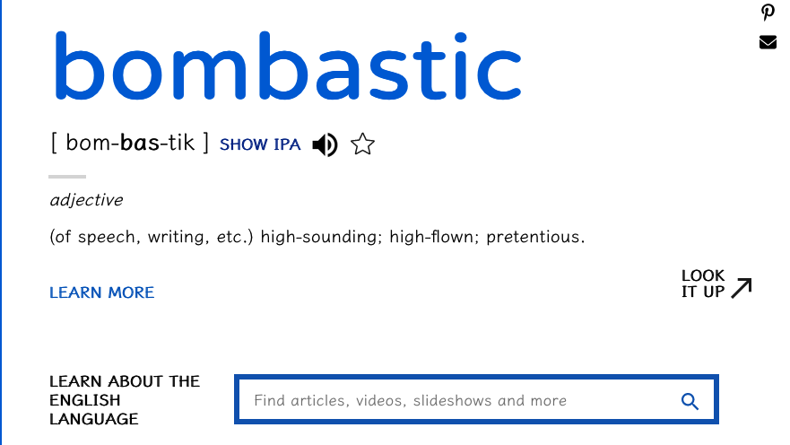

# VocabBuilderAI 記憶卡片擴充功能

## 描述：
VocabBuilderAI 是一款專為 Anki 設計的擴充功能，透過整合 OpenAI 的 GPT-3.5 Turbo 及 Whisper API，增強單詞學習體驗。它允許用戶為新單詞生成詳細的記憶卡片，包含定義、發音、詞源、同義詞、反義詞及實際例子。
除了Openai外，你也可以使用[Groq](https://console.groq.com/docs/openai), [Ollama](https://github.com/ollama/ollama/blob/main/docs/openai.md), [OpenRouter](https://openrouter.ai/docs#principles)等OpenAI Compatibility. 
- 
- 
## 功能：

    - 生成全面的單詞記憶卡片。
    - 整合 OpenAI GPT-3.5 Turbo 提供詳細的定義和例子。(可自行更改模型)
    - 使用 OpenAI 的文字轉語音模型提供發音音頻。(提供更真實的發音)
    - 可自訂設定預設的牌組、記憶卡片類型和標籤。
    - 整合進 Anki 的新增記憶卡片。

## 安裝：

    - 從 AnkiWeb 或 GitHub 下載。
    - 使用提供的代碼或安裝文件在 Anki 中安裝。
    - 在 Anki 的擴充功能選單中配置擴充功能設定，包括 OpenAI API 金鑰。
### 你需要自己建立"Node type"
 node type 的名字叫 "vocbuilderAI" 要有以下欄位(大小寫、空格都要一樣):
  - vocabulary
  - detail defination
  - Pronunciations
  - Sound
  - Etymology, Synonyms and Antonyms
  - Real-world examples
## 使用方法：

    - 在 Anki 中打開新增記憶卡片窗口。
    - 點擊 "VocabBuilderAI" 按鈕或選單項。
    - 輸入一個新單詞，擴充功能將生成完整的記憶卡片。

  
  
  
## 配置：

    - OpenAI API 金鑰：用於訪問 OpenAI 服務。
    - 預設牌組：未指定時新增記憶卡片的牌組。
    - 預設記憶卡片類型：用於新單詞的記憶卡片類型。
    - 語音選擇：選擇文字轉語音的語音。

## 支援：
如需支援、問題或功能請求，請訪問 GitHub 或聯繫作者。